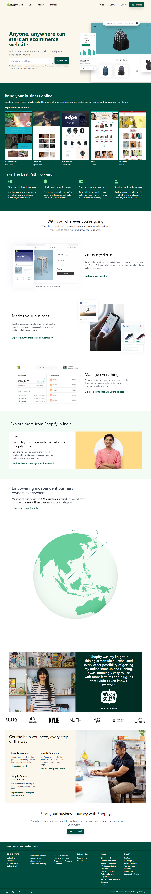

# Shopify Clone    
 
  
 This is a `resposnive` Shopify clone made for learning purposes using `tailwind css`. 

Made by - **Robin Khilery**

Duration : **12 Hours**

***
 
## :clipboard: Learnings
 In this project I explored about tailwind css , and indepth understanding of uilites classess of css .I also learn to read documention during this process.
 

## Deployed Link
 [click here to see deployed version](https://law-home-page-link.netlify.app/ "Click to Visit Link") 

## Screenshots

 